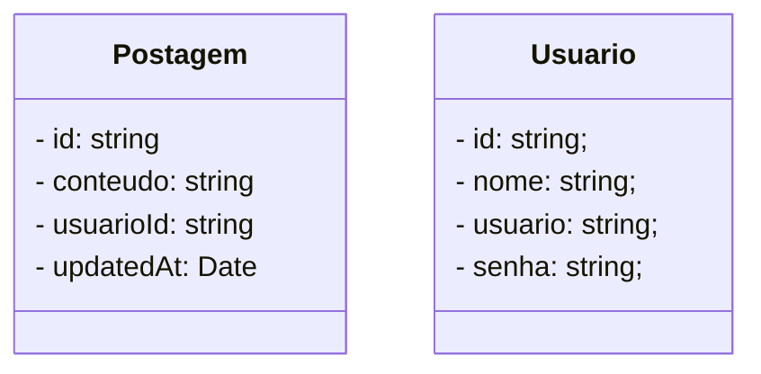

# Rede Social - NEO4J Database

 

     
     <b>com</b> 
     

 

## Diagrama de Classes

 

## Instalação do Neo4J Database no Windows

1. Acesse o site: https://neo4j.com/download/
2. Faça o cadastro para receber a Chave de Ativação
3. Faça o download do **Neo4J Desktop** 
4. Faça a instalação do **Neo4J** e adicione a **Chave de Ativação**
5. Inicialize o **Neo4J**. Será aberta a janela abaixo:

 

## Criação do banco de dados no Neo4J

- No Neo4j Desktop, clique no botão **New** para criar um novo projeto local.
- O nome do Projeto será **Rede Social**
- Dentro do projeto, clique no botão **Add**  e selecione a opção **DBMS local**.
- Especifique o nome  do Banco de dados: **db_redesocial**
- Configure o nome de usuário/senha
- O **Usuário padrão** do Neo4J é: *neo4j*
- A Senha deve ter no mínimo 8 caracteres
- Inicie o banco de dados clicando no botão **Start**.
- Observe o URI de conexão:
  - O URI de conexão normalmente será **bolt://localhost:7687**
  - As credenciais serão **neo4j** com a senha que você definiu anteriormente.
- Na imagem abaixo você confere o banco de dados configurado:

 

> [!IMPORTANT]
>
> **Enquanto você estiver executando a aplicação, o Neo4J Desktop deve permanecer aberto e conectado, como mostra a imagem acima.**

 

## Bibliotecas do NestJS

- [x] @nestjs/common 
- [x] @nestjs/core 
- [x] @nestjs/platform-express 
- [x] nest-neo4j 
- [x] @nestjs/config